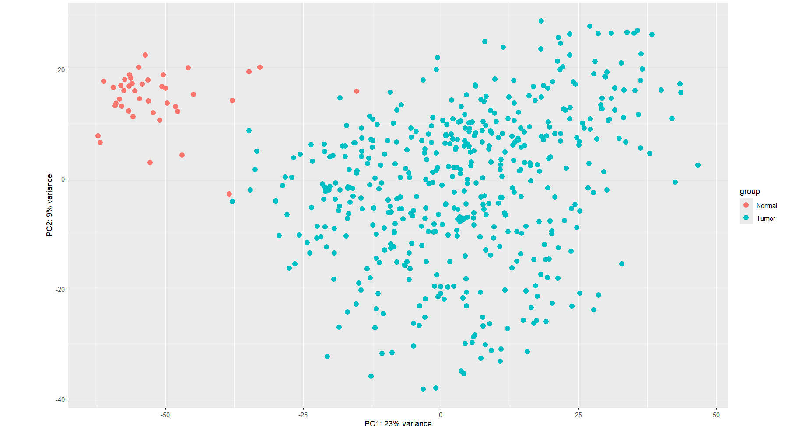
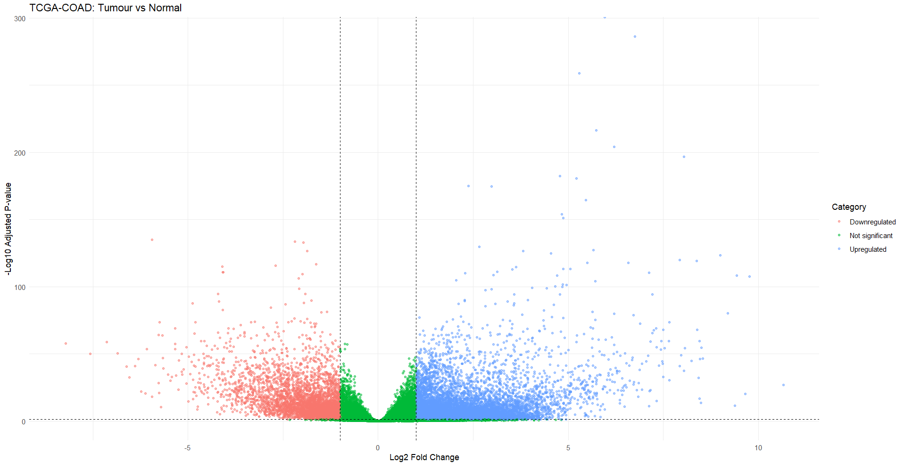
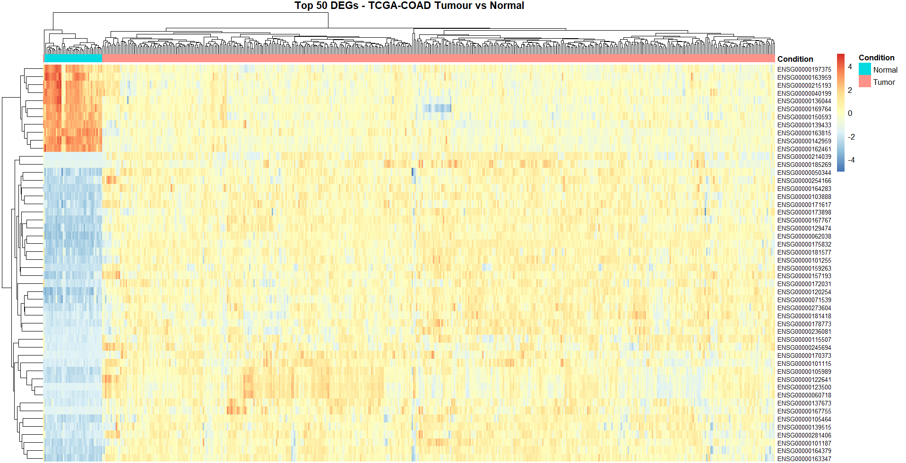
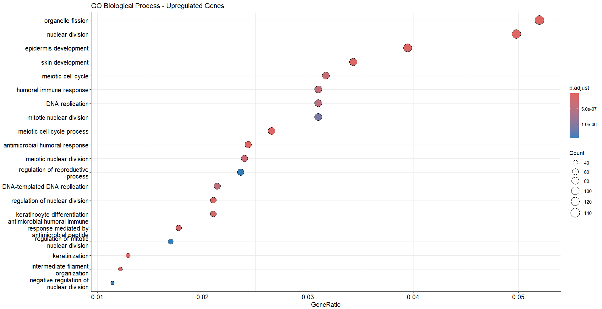
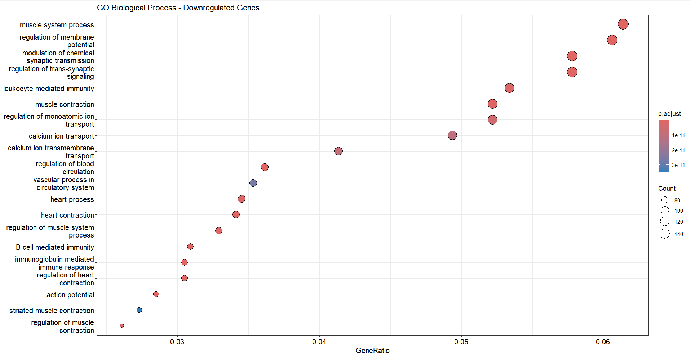

# DEG-analysis-of-TCGA-COAD

**Differential gene expression and Functional Characterisation in Colorectal Cancer (TCGA-COAD)**

A reproducible R/Bioconductor pipeline for identifying differentially expressed genes (DEGs) between colorectal tumour and normal tissue using TCGA-COAD RNA-seq data, with downstream functional characterisation via GO enrichment.

## 📋 Overview

This project analyses paired tumour vs. normal RNA-seq samples from the TCGA-COAD (Colon Adenocarcinoma) cohort to answer two questions:

- Which genes are significantly differentially expressed between colorectal tumour and normal tissue?
- What biological processes do those genes regulate?

## 🔄 Workflow

📥 **Data import** — Query and download STAR-counts gene expression data from GDC using TCGAbiolinks, restricted to Primary Tumor and Solid Tissue Normal samples.

🧹 **Preprocessing** — Build sample metadata, label tumour/normal condition, align sample and count matrix ordering, and filter low-expression genes (counts ≥ 10 in at least 3 samples).

📊 **Differential expression** — Run DESeq2 with a tumour-vs-normal design, extract results, and classify genes as upregulated or downregulated (padj < 0.05, |log2FC| > 1).

🏷️ **Annotation** — Map Ensembl gene IDs to gene symbols using org.Hs.eg.db.

📈 **Visualisation** — Generate a volcano plot, PCA plot (VST-transformed data), and a heatmap of the top 50 DEGs.

🧠 **Functional enrichment** — Run GO Biological Process enrichment (clusterProfiler::enrichGO) separately for up- and downregulated gene sets, using all tested genes as the background universe.

## 🛠️ Tools & Packages

TCGAbiolinks · DESeq2 · SummarizedExperiment · org.Hs.eg.db · clusterProfiler · enrichplot · pheatmap · ggplot2

## 📁 Repository Structure

- `scripts/` — R scripts, split by pipeline stage
- `results/` — Output DEG and GO enrichment tables (CSV)
- `figures/` — Volcano plot, PCA plot, heatmap, GO dot plots
- `data/` — Not tracked — see `data/README.md` to regenerate

## 📊 Results

Starting from 60,660 genes × 522 samples (481 Tumor, 41 Normal), low-expression filtering retained 38,447 genes for testing.

| Category | Gene count |
|---|---|
| Total significant DEGs (padj < 0.05, \|log2FC\| > 1) | 14,525 |
| Upregulated in Tumor | 10,599 |
| Downregulated in Tumor | 3,926 |

**PCA** (VST-transformed data) shows clear separation between groups: Normal samples cluster tightly, while Tumor samples are much more spread out — consistent with the known transcriptional homogeneity of healthy tissue versus the molecular heterogeneity of tumours.



**Volcano plot** shows a clear asymmetry between up- and downregulated genes, with several high-confidence outlier genes on the upregulated side.



**Heatmap** of the top 50 DEGs (z-score scaled, hierarchically clustered) visually separates Tumor and Normal samples on the strongest differential signals.



Several top DEGs are established colorectal cancer markers, lending biological validation to the pipeline — e.g. **CDH3, CLDN1, WNT2, ETV4** (upregulated) and **IL6R, ABCG2** (downregulated).

**GO Biological Process enrichment:**

| Direction | Dominant themes |
|---|---|
| Upregulated | Cell cycle / proliferation (nuclear division, DNA replication), keratinization / epidermis development, antimicrobial/humoral immune response |
| Downregulated | Muscle system processes, muscle/heart contraction, ion transport (calcium, membrane potential), B-cell/immunoglobulin-mediated immunity |




## 📌 Key Outputs

- 📄 `TCGA_COAD_significant_DEGs.csv` — all significant DEGs (padj < 0.05, |log2FC| > 1)
- 📄 `TCGA_COAD_upregulated_genes.csv` / `_downregulated_genes.csv` — split by direction
- 📄 `TCGA_COAD_GO_Upregulated.csv` / `_GO_Downregulated.csv` — enriched GO Biological Process terms
- 🖼️ Volcano plot, PCA plot, and top-50 DEG heatmap in `figures/`

## ⚠️ Challenges & Limitations

- **R syntax error during library loading.** A stray `-` before an inline comment (`library(SummarizedExperiment) - # comment`) caused R to interpret the line as subtraction rather than a function call plus comment, throwing a misleading error. Fixed by moving the comment to its own line.
- **Class imbalance.** The cohort contains far more Tumor samples than Normal (481 vs 41), typical of TCGA but worth noting as a limitation on statistical power for the Normal group.
- **Incomplete gene symbol mapping.** A small number of Ensembl IDs did not resolve to an HGNC symbol via `org.Hs.eg.db` (common for lncRNAs/pseudogenes); these were retained under their Ensembl ID rather than dropped.
- **Substantial ID mapping loss before GO enrichment.** Converting Ensembl → Entrez IDs for `clusterProfiler` failed for **45.4%** of upregulated genes, **19%** of downregulated genes, and **32.2%** of the background set — expected, since Ensembl/GENCODE includes many gene biotypes absent from Entrez. GO enrichment results therefore represent only the well-annotated, protein-coding subset of the DEGs, not the full significant gene list.
- **Downregulated GO terms likely partly reflect tissue composition.** The dominance of muscle/heart-contraction terms among downregulated genes plausibly reflects relative loss of muscularis (smooth muscle) tissue content in tumour samples rather than purely cancer-cell-intrinsic changes, since bulk RNA-seq captures the full tissue mixture rather than purified epithelial/tumour cells.

## 🔁 How to Reproduce

```r
install.packages("BiocManager")
BiocManager::install(c(
  "TCGAbiolinks", "SummarizedExperiment", "DESeq2",
  "org.Hs.eg.db", "AnnotationDbi", "clusterProfiler",
  "enrichplot", "pheatmap"
))
install.packages("ggplot2")

source("scripts/tcga_coad_deseq2_analysis.R")
```

> Note: the initial `GDCquery()` / `GDCdownload()` step retrieves RNA-seq data for 522 samples from GDC and may take significant time and disk space on first run.

## Author

Keerthana Yakkaluru
MSc Bioinformatics & Computational Genomics, Queen's University Belfast
